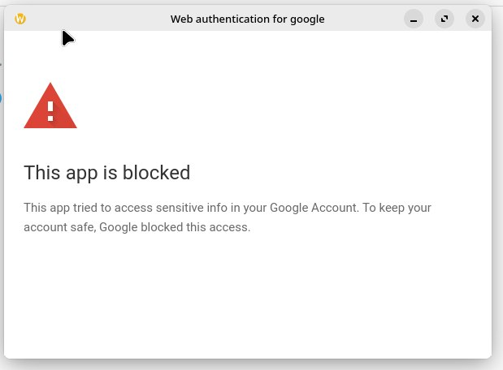
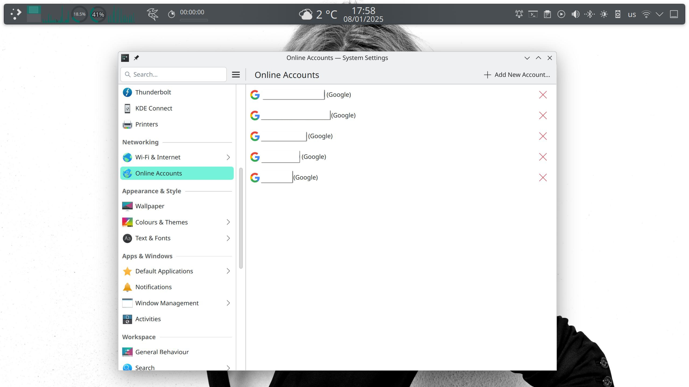

# Fix Google Account Authentication and Drive Integration Issues on KDE Plasma

[](https://shields.io/)

A community-driven solution to resolve critical authentication issues between KDE Plasma desktop environments and Google services integration.

<p align="center">
<a href="./assets/this-app-is-blocked.jpg">
  
</a>
<a href="./assets/kde-online-accounts.jpg">
  
</a>
<p>

## 📌 Overview

This repository addresses two critical authentication issues affecting KDE users across multiple distributions:

1. **"This browser or app is not secure"** error during login
2. **"This app is blocked"** error when accessing Google Drive

The solution involves strategic configuration modifications validated across six major Linux distributions.

## 🚀 Quick Start

### Prerequisites

- KDE Plasma 5.24+ environment
- `kaccounts-integration` package installed
- Active internet connection

### Installation

```bash
curl -sSL https://raw.githubusercontent.com/Amm1rr/Fix-Google-Account-on-KDE/main/fix_kde_google_integration.sh | bash
```

### Post-Installation

```bash
kquitapp6 kded6  # Restart KDE core services
systemctl --user restart plasma-kglobalaccel  # Refresh desktop services
```

## 🛠 Known Issues and Solutions

<details>
   <summary>
   <h3>Issue 1: Untrusted Browser Error</h3>
   </summary>

**Error Message**:  
"This browser or app is not secure"

**Affected Systems**:  
Arch Linux and derivatives using `signon-ui` package

**Root Cause**:  
The `fake-user-agent.patch` in `signon-ui` modifies browser headers in a way that triggers Google's security checks.

**Solution**:  
Package rebuild without the problematic patch:

```bash
# Example for Arch-based systems
asp export signon-ui
cd signon-ui/trunk
sed -i '/fake-user-agent.patch/d' PKGBUILD
makepkg -si
```

</details>

<details>
   <summary>
   <h3>Issue 2: Application Block Error</h3>
   </summary>

**Error Message**:  
"This app is blocked"

**Affected Systems**:  
All Linux distributions using KDE 5.24+

**Root Cause**:  
Invalid OAuth Client ID in KDE's Google provider configuration:

```
317066460457-pkpkedrvt2ldq6g2hj1egfka2n7vpuoo.apps.googleusercontent.com
```

**Solution**:  
Replace with GNOME's validated Client ID:

```
45471411055-ornt4svd2miog6dnopve7qtmh5mnu6id.apps.googleusercontent.com
```

</details>

## 🔍 Technical Implementation

The script performs the following critical modifications:

1. **Configuration Replacement**:

   ```bash
   /usr/share/accounts/providers/kde/google.provider
   ```

   - Replaces KDE's client ID with GNOME's validated credentials
   - Updates OAuth scopes for proper Drive integration

2. **Scope Modifications**:

   ```ini
   ; Before
   ServiceScopes=https://www.googleapis.com/auth/drive

   ; After
   ServiceScopes=https://www.googleapis.com/auth/drive.file
   ```

3. **Safety Measures**:
   ```bash
   # Create timestamped backups
   cp /usr/share/accounts/providers/kde/google.provider{,.bak_$(date +%s)}
   ```

## 🔄 Post-Update Considerations

After KDE framework updates, re-run the script to:

1. Check configuration integrity
2. Reapply necessary modifications
3. Validate service permissions

## 📚 Documentation

### File Structure

```
/usr/share/accounts/providers/kde/
├── google.provider          # Main configuration
└── google-drive.provider    # Drive-specific settings
```

### Critical Parameters

| Parameter     | Original Value            | Modified Value                  |
| ------------- | ------------------------- | ------------------------------- |
| ClientId      | KDE-specific OAuth ID     | GNOME OAuth ID                  |
| ServiceScopes | Full Drive access         | Restricted file-specific access |
| UserAgent     | KDE-specific agent string | GNOME-compatible agent string   |

## 🚨 Troubleshooting

### Common Issues

1. **Permission Denied**:

   ```bash
   sudo chmod +x /usr/share/accounts/providers/kde/google.provider
   ```

2. **Partial Drive Access**:
   Re-authenticate through KDE System Settings > Online Accounts

3. **Post-Update Failures**:
   ```bash
   sudo pacman -Syu kaccounts-integration
   curl -sSL https://raw.githubusercontent.com/Amm1rr/Fix-Google-Account-on-KDE/main/fix_kde_google_integration.sh | bash
   ```

## 📜 References

1. [KDE Forum Discussion](https://discuss.kde.org/t/kde-online-accounts-not-signing-in/3411/38)
2. [Google OAuth API Documentation](https://developers.google.com/identity/protocols/oauth2)
3. [GNOME Online Accounts Implementation](https://gitlab.gnome.org/GNOME/gnome-online-accounts)

## 🙏 Credit

Special thanks to [Bruno Gonçalves](https://discuss.kde.org/u/Bruno_Goncalves) for initial problem diagnosis and solution prototype.
